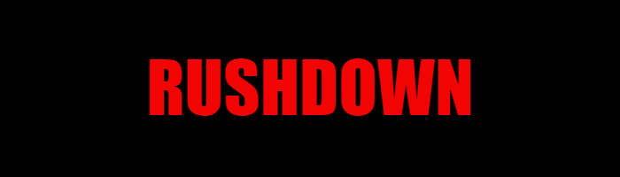  

# Table Of Contents
- [Table Of Contents](#table-of-contents)
- [Rushdown](#rushdown)
- [UX design](#ux-design)
  - [Color scheme](#color-scheme)
  - [Layout](#layout)
  - [Typography](#typography)
  - [Wireframes](#wireframes)
- [Features](#features)
  - [Existing features](#existing-features)
    - [Header and navigation](#header-and-navigation)
      - [**Images**](#images)
    - [Footer](#footer)
      - [**Images**](#images-1)
    - [Homepage(index.html)](#homepageindexhtml)
      - [**Images**](#images-2)
    - [Gallery (gallery.html)](#gallery-galleryhtml)
      - [**Images**](#images-3)
    - [Sign up page (sign-up.html)](#sign-up-page-sign-uphtml)
      - [**Images**](#images-4)
    - [Confirmation page (confirmation.html)](#confirmation-page-confirmationhtml)
      - [**Images**](#images-5)
  - [Future features](#future-features)
- [Testing and bugs](#testing-and-bugs)
- [Technologies used](#technologies-used)
- [Deployment](#deployment)
  - [Local Deployment](#local-deployment)
- [Credits](#credits)
  - [Content](#content)
  - [Media](#media)
  - [Acknowledgements](#acknowledgements)
# Rushdown 
The sport of mixed martial arts has exploded in popularity in recent years. It is clear that there is a growing demand to participate and learn about the sport. Various famous fighters have emerged from Ireland in the past few years, including "The Notorious" Conor Mcgregor, along with other reputable fighters such as Normin Parke and Joe Duffy. Rushdown MMA attempts to supply this demand and offer everyone from MMA enthusiasts to professional UFC stars a place to train and improve upon their technique. This project aims to create a website for the company, and showcase how it can help the MMA community improve their skills, fitness and technique.  
The full **[Rushdown](https://conorg180.github.io/rushdown-mma-gym/index.html)** website can be seen here.  
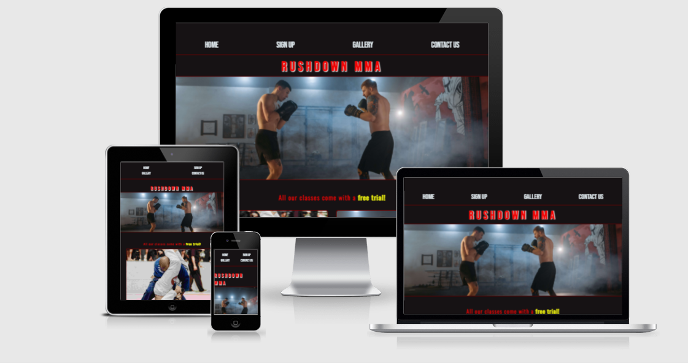
# UX design
The website is designed so that the user can easily understand and process what each webpage's main theme is with minimal effort and in a short amount of time. For this reason, the webpages are not overcrowded with information that may deemed to be irrelevant. It's design, whilst aesthetic, was in fact made to be minimalist. Fonts and colors were chosen with accessibility being the top priority, but whilst also having a visually-appealing quality to them.  
Key, important features of the website, are highlighted in a different color font and/or placed strategically. For example, the sign-up button is on the top left of the page, which is generally one of the first things that the user will notice. Also, various sign up links, such as those on the gym cards, are highlighted in yellow. There are also various "hover" animations to draw the user to the button when hovering.  
The website is also designed to show the user that there are features further along down the page, which can be seen when the user enters the page first. For example, when the user enters the homepage, they can see the top sections of each gym card. The same can be said for the sign-up.html page, where the user can see the tops of the forms as soon as they enter the page. This encourages the user to scroll down the page and explore the page in more detail.  
Furthermore, to ensure an optimal user experience while keeping a simple interface, many different forms of media are used to convey different features of the gym. For example, we can see the gym cards and images in the gallery page use pictures, text and hovering animations to convey their message. The gym tour is expressed via a video. Contact information of the gym is designed usiing either a combination of icons and text (phone number, email etc.), icons and links (social media links) or a map (to show the gym's location).
## Color scheme
The color scheme chosen for this website is based on a monochromatic color scheme, but also consists of some complimentary colors to draw the user's attention to certain areas of the page, such as on the sign-up buttons. The colors were chosen with the help of [mycolor.space](https://mycolor.space/)
- The color's red, black and yellow were chosen so as to design "strong" and eye-catching aspects of the website. As the company is an MMA gym, it was thought that this combination of colors would work well with the theme that this company wants to convey.
- There are multiple shades of primary colors which allows for stylistic, monochromatic styling throughout each page. An example of this can be seen in the borders of certain elements on each page, which use a darker version of the website's primary color. 
- Futhermore, the website can be easily changed in the future if needed due to the use of CSS root variable in the project. The colors can be seen in the below image:  
 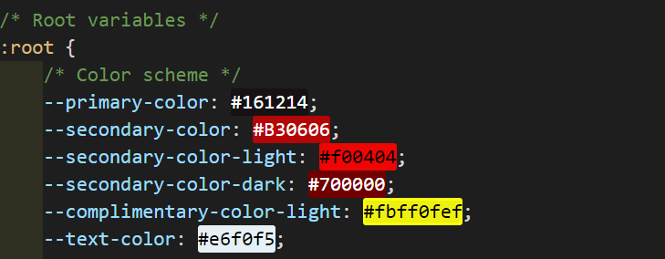
## Layout
Grid is the primary css function used in building the layout to this website, and it was chosen for multiple reasons:
 - With grid, it is very easy to reposition and even swap elements on the website in the future if needed.
 - Grid allows responsive designs to be carried out easily, and it was thought that it would be a great choice since responsiveness is a high priority in this project. Elements can be programmed to scale down to a minimum and maximum size, and can then easily be changed as needed when using media queries.
 - This project includes a lot of images, including a whole gallery page. With grid, it is a lot easier to work with so many images, as it allows the developer to change many pictures sizes/aspect ratios at once by simply changing the size of the grid, or spanning pictures across different rows/columns etc. This can be seen in the gallery, where some pictures have classes such as "landscape" or "big" which span more or less rows/columns depending on their class. This also allows the code to be reusable.
 ## Typography
 As with colors, root variables were used to store various fonts and back-up fonts. These can be seen below:  
 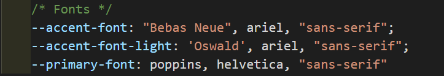
  - Bebas Neue was chosen as the main accent font for the project due to it's easy-to-read and clear edges used throughout font. It was found to be particularly useful for the "Rushdown" logo and navigation links within the header. All letters in the Bebas Neue font are capitalised, so whilst great for main headers and links, a different font was decided on for smaller headings.
  - Oswald was chosen as the websites secondary-header (h2 - h6) font. It can be seen in smaller headers throughout the website, such as on the gym card headers. Unlike Bebas Neue, Oswald allows for lowercase letters too. It has long been reknowned as a fashionable eye-catching font, and it seemed to work very well when working with smaller headers.
  - Poppins was chosen as the website's main "text" font. This font is used in all paragraphs and descriptions throughout the website. Each letterform in poppins in almost monolinear, and it is designed to maintain an even typographic color throughout it's usage.
  -  The main icons used throughout the website came from [fontawesome.com](https://fontawesome.com/). They supplied the icons for all social media links and the company's contact information. It also supplied the icons used in the confirmation.html page's gear animation.

## Wireframes
Before starting development on the project, Balsamiq was used to form wireframes for each separate page. Basamiq was chosen due to it's efficiency and it's ability to reproduce relatively simplistic, yet easy to understand wireframes. This helped me to visualise ideas for the pages and organise how certain features would be laid out in the website. The [confirmation.html](https://conorg180.github.io/rushdown-mma-gym/confirmation.html?chosen-free-trial=Brazillian-jiu-jitsu) page which appears once a user has signed up to the gym or a free trial was not originally included in the wireframes, as this idea was only realised towards the end of the project.  
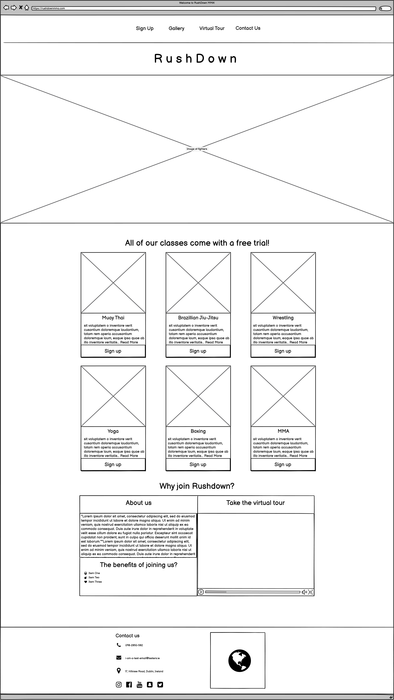
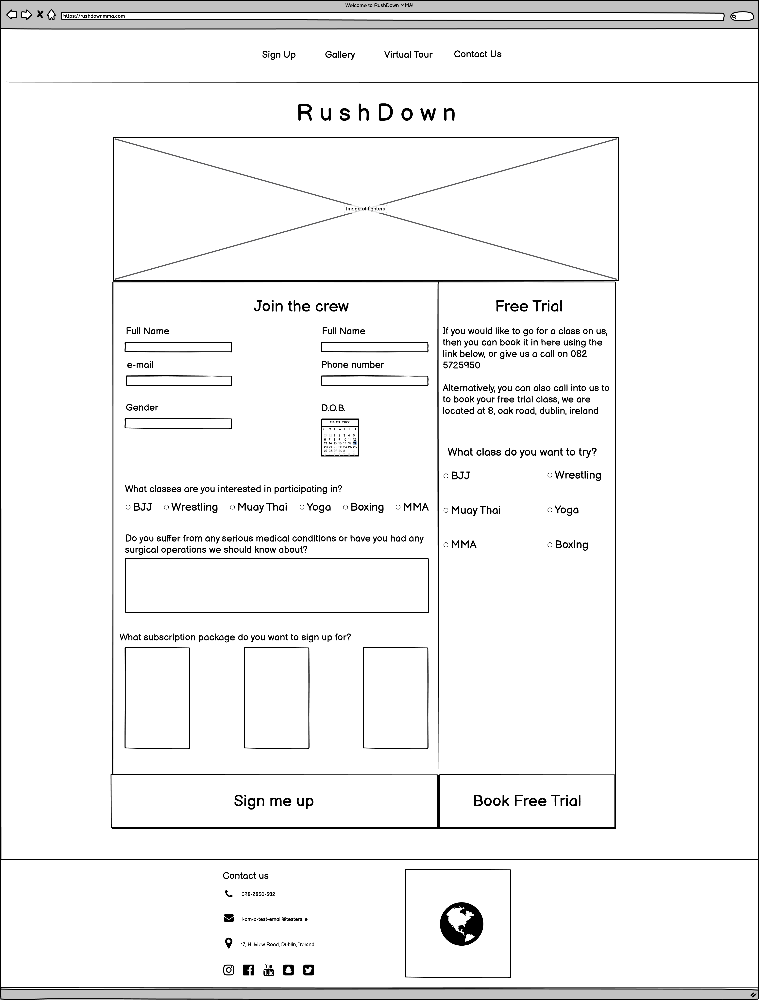
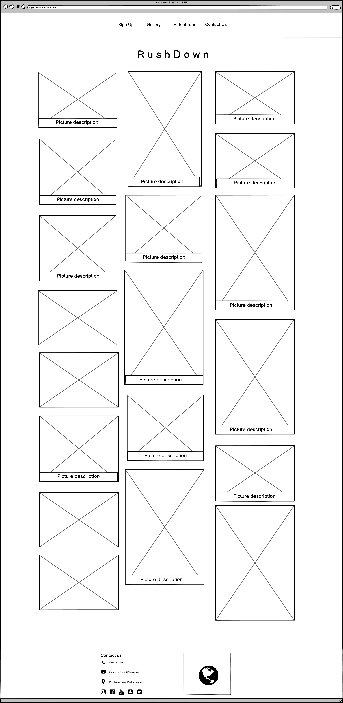

# Features
## Existing features

### Header and navigation
The header is used univerally throughout all pages in the website and always remains the same. The exception to this is at smaller screen sizes, where navigation links are stacked on top of eachother to accomodate for the user's smaller screen size.
- The header includes links to the all pages within the document (With the exception of the confirmation.html document) and allows for simple user navigation. 
- Animations were also added to each navbar link to increase the user experience and provide an appealing look when hovering over links.  
  #### **Images**  
    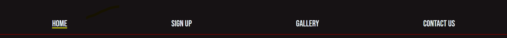

### Footer
Like the header, the footer is designed to remain consistent in it's style throughout the website, with the exception again being found at smaller screen sizes. 
- The footer contains contact information for RushDown MMA including the company's contact details, a location of the gym on Google Maps, and links to all the gym's social media accounts.
- There is also a "Contact us" link in the header of the website which will redirect users to the footer of the website, where all the contact information is stored.  
  #### **Images**  
    

### Homepage(index.html)
The homepage is the first page that the user will see, and so, it is vital that this page provides a positive and intuitive user experience. The homepage is designed to show the core information about the gym that the user will want to know. 
- Included is a description of each gym class that the gym offers, along with a sign-up button within each class card so that the user can easily access the sign-up page.  
- There is also an about us section, which allows the user to read about how the gym was formed and about it's owner.
- A gym tour was designed into the homepage to allow the user to instantly get a feel for what the gym looks like on the inside. controls were input so that the user can pause, rewind and skip through the video as the please.   
  #### **Images**  
    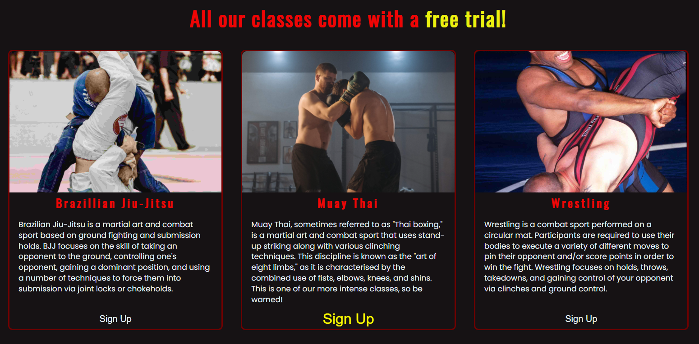
    

### Gallery (gallery.html)
The gallery page within the website aims to showcase the true, raw images of the gym and it's various aspects, themes and principals.
- Images in the gallery showcase classes, competitions, comradery amongst teammates, the physical features of the gym, the instructors, and various sparring sessions amongst members.
- The gallery also includes various features such as captions which appear on the images when hovering, and the ability to click on images to view them full size in a different tab.
- Different aspect ratios were applied to different images (By way of CSS classes) To allow certain images to appear in their natural ratio (some images may be portrait, landscape, or square etc). By doing this, images come across as more aesthetic to the user and it minimises the effect of images being cut off/cropped.    
  #### **Images**  
    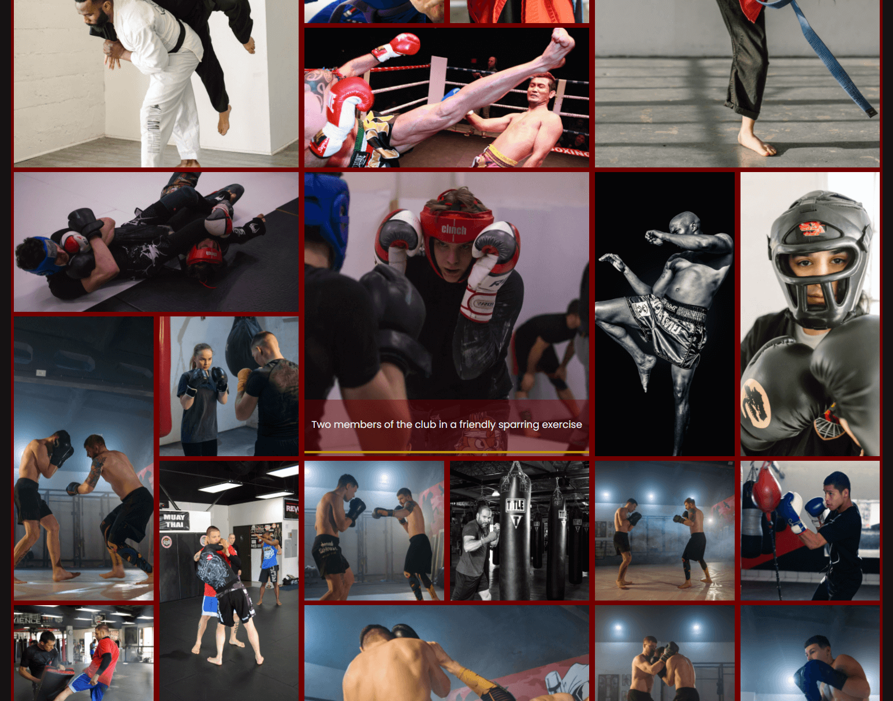

### Sign up page (sign-up.html)
The sign up page allows the user to easily and quickly sign up to the gym membership, whilst also collecting all necessary information required for the application. 
- Both forms are designed so that they can be filled in quickly and without any complications. 
- The membership form allows the user to express which classes they have an interest in, and enables them to choose different membership/payment options.  
- There is a free trial form included in the sign up page for those who may be unsure of committing to the gym completely, but who still want to trial it. This form simply asks for which class they want to trial, which was deemed to be accepatable since they are not applying for a full membership.  
  #### **Images**
    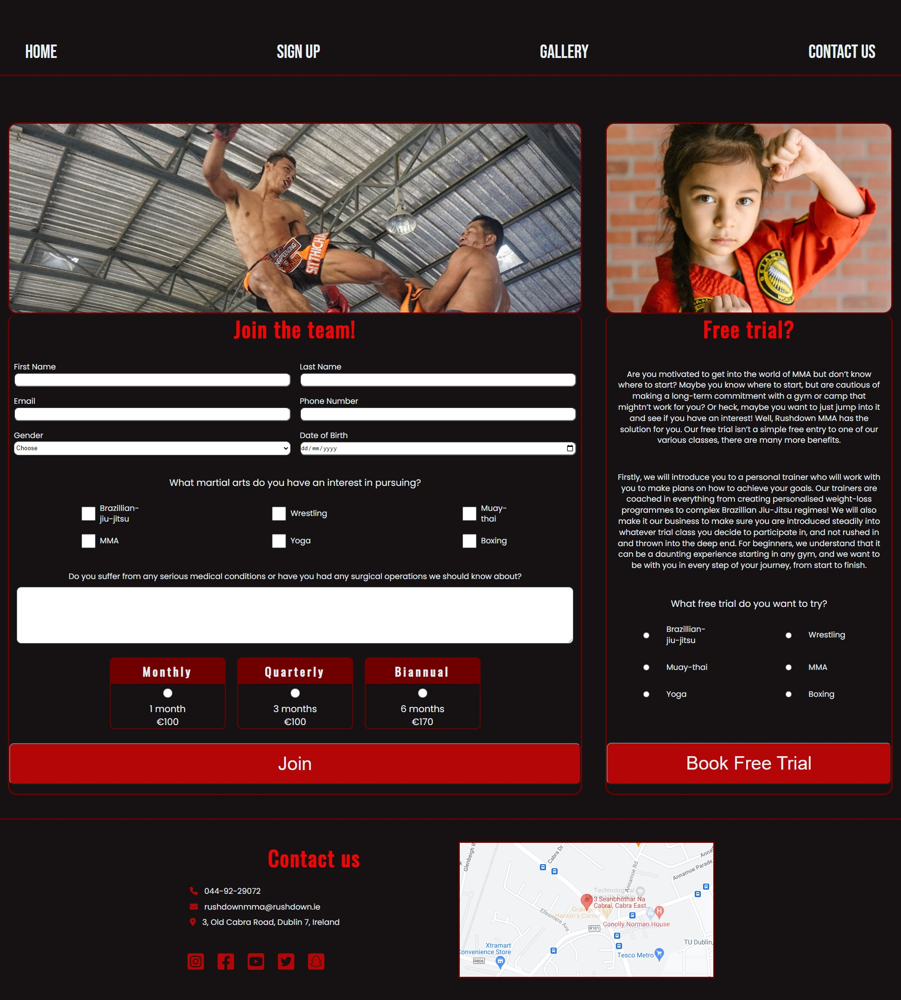

### Confirmation page (confirmation.html)
The confirimation page is the most simple of all the pages built in this project, and is simply there to provide a more professional experience once the user signs up to the gym in the form of a membership, or completes a form to join a free trial class. The confirmation page is designed to offer a quick summary of the company's gratitude for signing up (By saying thank you), reminding the user of the company's contact information, and also includes a link to redirect the user back to the homepage should they not be redirected due to a bug.  
  #### **Images**
  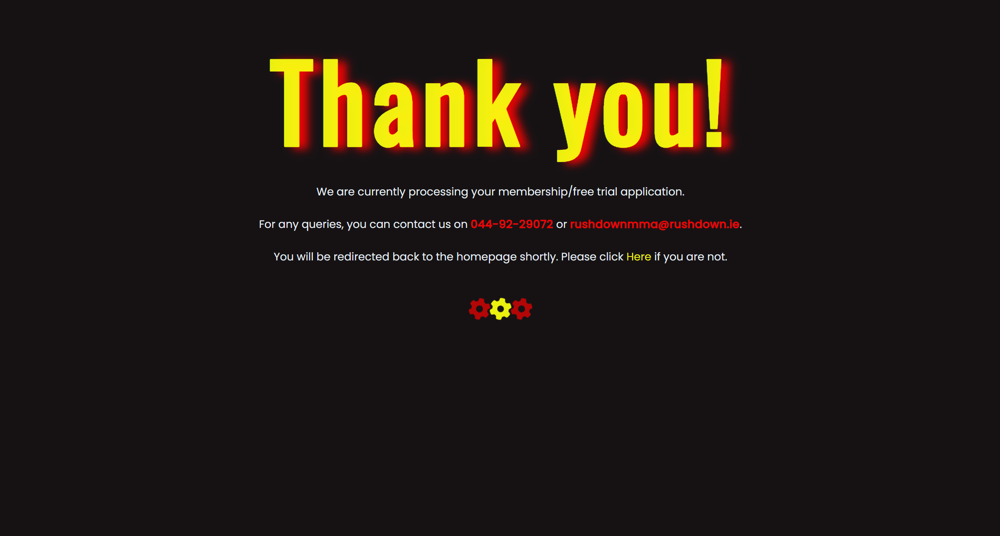

## Future features
There are some features which I believe could be a good idea to implement in the future, along with some other features which could be rebuilt to be better.
- In the confirmation.html page, it may be a good idea to rebuild the redirect feature. At the moment, a "refresh" type meta tag is being used to redirect the user back to the homepage. However, This has slightly lowered the accessibility of the page acording to lighthouse. According to lighthouse, it is possible that Javascript may be a better alternative to achieve this outcome, as doing so would not decrease the accessibility score of the page.
- A "news" page for the website which shows articles/social media posts related with the gym, upcoming events, and member's competition results may be a good feature to implement.
- A timetable outlining the gym's class schedule and which instructors are teaching each class could be a great feature to design. The timetable could also use a color-coded system to highlight the difficulty level of the class, such as beginner, intermediate, advanced etc.
- Member's accounts. This feature would allow members to create an account and log in, which may give them extra features such as being able to book a class in advance and book personal training/combat sessions with specific gym instructors.

# Testing and bugs
For all testing, please refer to the [TESTING.md](TESTING.md) file.

 # Technologies used
 The following technologies were used in the development of this project
  - [html](https://developer.mozilla.org/en-US/docs/Web/HTML) - html was used to apply the structure and to create the elements of each webpage in the project.
  - [CSS](https://developer.mozilla.org/en-US/docs/Web/CSS) - CSS was used to style each page of the project and controls the layout, color scheme, animations, hover-effects and image-sizing.
  - [Git](https://git-scm.com/) - Git was used for version control throughout this project.
  - [Balsamiq](https://balsamiq.com/) - Balsamiq was used to create wireframes at the beginning of the project and aided in visualising ideas and features of the website
  - [Gitpod](https://www.gitpod.io/) - Gitpod was used as the integrated developement environment for the website and to deploy the website.
  - [Github](https://github.com/) - Github was used to host the project through Github pages.

# Deployment
The site was deployed to GitHub pages. The steps to deploy are as follows: 
  - In the [GitHub repository](https://github.com/ConorG180/rushdown-mma-gym), navigate to the Settings tab 
  - From the source section drop-down menu, select the **Main** Branch, then click "Save".
  - The page will be automatically refreshed with a detailed ribbon display to indicate the successful deployment.
  
The live link can be found [here](https://conorg180.github.io/rushdown-mma-gym)

## Local Deployment
In order to make a local copy of this project, you can clone it. In your IDE Terminal, type the following command to clone my repository:

- `git clone https://github.com/ConorG180/rushdown-mma-gym.git`

Alternatively, if using Gitpod, you can click below to create your own workspace using this repository.  

# Credits
## Content
The sources below were used when trying to solve intricate problems within the programme and played a solid role in helping me to build this project.
 - [W3schools](https://www.w3schools.com/) was used as a learning resource and helped me with html and CSS.
 - Kevin Powell's [Youtube Channel](https://www.youtube.com/kepowob) was used as a learning resource and helped me with html and CSS .
 - [Stack Overflow](https://stackoverflow.com/) was used as a learning resource and helped me with html and CSS.
 - [ColorSpace](https://mycolor.space/) aided me in designing a color theme for the website.
 - [Balsamiq](https://balsamiq.com/) helped me to design the wireframes for the project
 - [Google Fonts](https://fonts.google.com/) supplied the fonts used throughout the website.
 - [Font Awesome](https://fontawesome.com/) supplied the icons used throughout the website.
## Media
All images and videos used in the project came from the following sources:
- [Pexels](https://www.pexels.com/)
- [Unsplash](https://unsplash.com/)
- [Stockvault](https://www.stockvault.net/)
## Acknowledgements
I want to thank the following people and companies for their help in providing solid technical support whilst developing this project.
 - Tim Nelson (Code Institute mentor)
 - [Code Institute](https://codeinstitute.net/ie/)