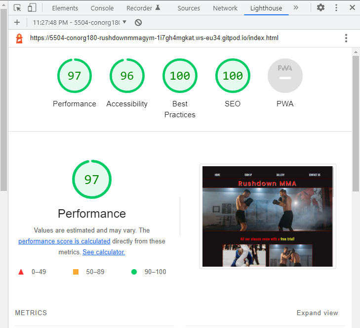
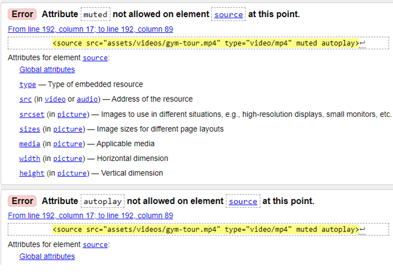
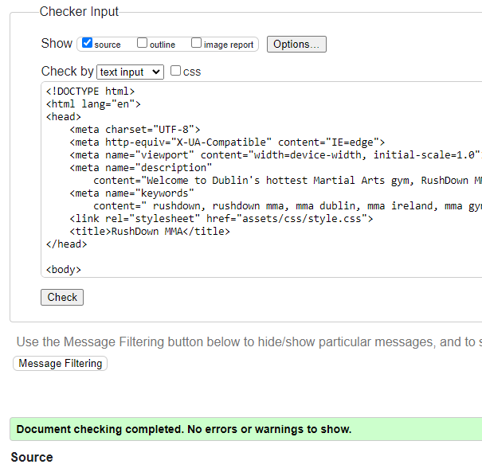
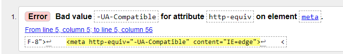
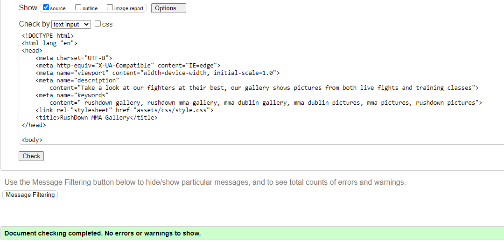
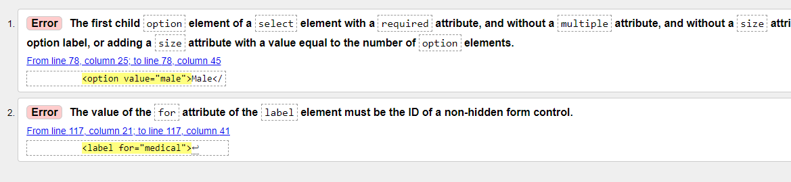
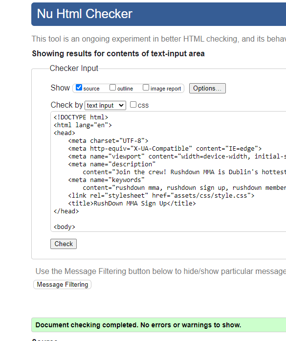
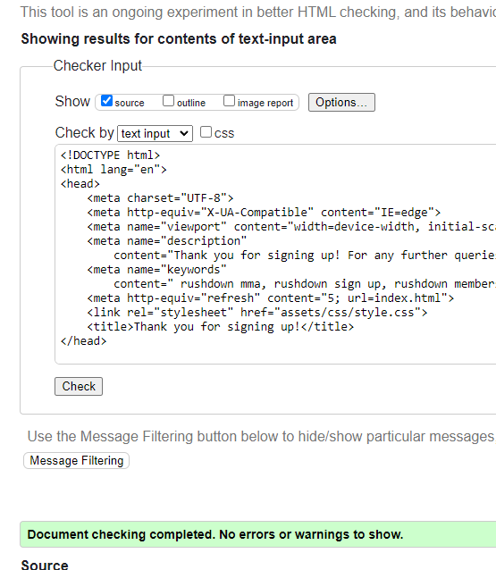
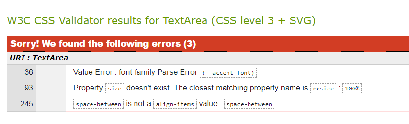
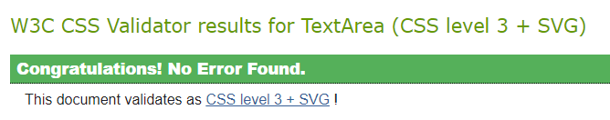

# Testing

## Browser Compatability
Testing of the website was carried out in Firefox, Microsoft Edge, Opera and Google Chrome. The website seemed to work without on any issues on the above browsers. However, some older versions of firefox in particular may not support the "aspect-ratio" property of CSS which is used on images, which caused some bugs. However, new versions of Firefox do support aspect-ratio, so this should not be an issue for most users.

## Code Validation and identified bugs

# Testing and bugs
The following tools and technologies were used to test this project:
 ## Lighthouse
  Lighthouse was used to test and audit the website across four main areas; performance, accessibility, best practices, and SEO. All pages of the document were tested, and some minor changes were made to each page when bugs were found. After retesting each page, all accessibility scores were at least 95% or higher with the exception of confirmation.html. Some significant bugs that were found in lighthouse testing and their solutions are listed below.
  ### **Footer** 
- Within the footer on each page, all iframe elements were missing a "title" attribute, lowering accessibility scores for every page in the process.
  -  This was easily fixed by adding in a title attribute to the iframe tags
 ### **sign-up.html**
- There was no for attribute on the date of birth label. 
  - To fix this, a for attribute was added which matched its input element's id.
 ### **confirmation.html** 
- It was discovered in confirmation.html that there was not enough contrast within the document, specifically within the span tags which held the company's contact information.
  -  To solve this, the font was changed to a brighter color and made bold, increasing it's contrast. 
-   Another issue was discovered with the page's "refresh" meta tag, used to redirect the user back to the homepage. This was shown to lower the accessibility score on lighthouse's audit. 
    -  A solution to this problem would be to use Javascript. At the beginning of this project, it was decided that it would be made strictly using html and CSS. However, this may be solved in an upcoming version with the use of Javascript.
 
#### lighthouse score after retesting:

  ## W3 html validator
W3 html validator was used on each html document within the project to confirm that there were no errors made in the code. Whilst testing, there were some minor bugs found on some pages. However, each bug was fixed, and after retesting, no errors were found. The bugs for each page are listed below and pictures are shown of before and after the bugs were fixed.
  ### **index.html** 
  - Video mute and autoplay attributes were included on a source element in index.html for the gym video tour. 
    - This is incorrect html code and it was removed.
 #### index.html screenshots:  
 
   

  ### **gallery.html** 
  - The gallery-container within gallery.html was actually a section element, which needs to include a header. 
    - The section element was replaced with a div, as the gallery-container only contained images, and had no need for a separate header.
  
  #### gallery.html screenshots:
  
   

  ### **sign-up.html** 
  - There was a "for" attribute on the medical-history label which didn't match it's id counterpart's value in the textarea element.
    - The for attribute was changed to match the id in the textarea element
  - Furthermore, the gender select element needed to have it's first element with an empty string in it's "value" attribute.
    - The first option in the gender select element was changed to a "Choose" option, which is not selectable. It simply gives directions to the user to choose an option from the list.
  #### sign-up.html screenshots:
  
 

 ### **confirmation.html** 
  - There were no bugs found in confirmation.html.
  #### confirmation.html screenshots:
 

  ## W3C CSS validator
  The W3C CSS validator was used to test the project's style.css document. 
  Some minor bugs were found throughout the CSS document. A description of each bug and an image of all the bugs are listed below, along with another image showing how the test went when all bugs were fixed.
  ### **styles.css**
- The root variable on the h1 tag in index.html was not being applied to the style due to a typo/bug.
  -  The typo was corrected. When the new style updated on the h1 tag, letter spacing and margin/padding was updated accordingly so as to not cause responsiveness issues.
- There were certain pieces of CSS code within the document which had no effect within the document.
    - These were removed from styles.css.
#### styles.css screenshots:  
 
 

# Responsiveness
##Amiresponsive
  Amiresponsive is a website which was used to test how the website will appear across different devices.
- Whilst testing with amiresponsive, one element of the website seemed to portray a negative user experience; the scrollbar. Whilst being necessary, it was deemed to be unesthetic.
  - To fix this, the scrollbar was hidden, but it's functionality was kept.
  #### Amiresponsive screenshots:

## User Story Tests

## Unfixed Bugs
There are no unfixed bugs that I am aware of.